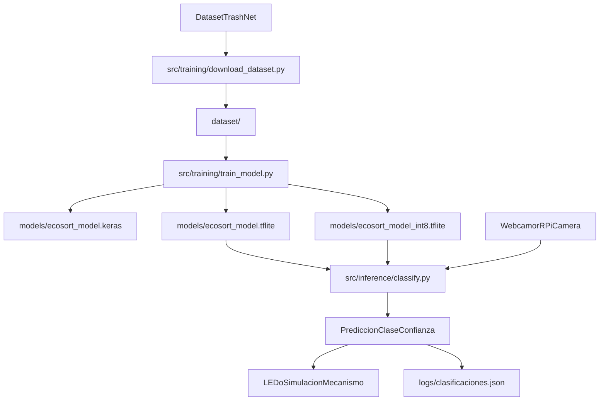

# Arquitectura EcoSort IA

Diagrama de flujo de alto nivel del sistema:

## Componentes
- `src/training/`: descarga de dataset y entrenamiento del modelo.
- `scripts/`: utilidades para exportacion y compatibilidad TFLite.
- `src/inference/`: clasificacion en tiempo real.
- `src/config.py`: constantes globales del proyecto.

